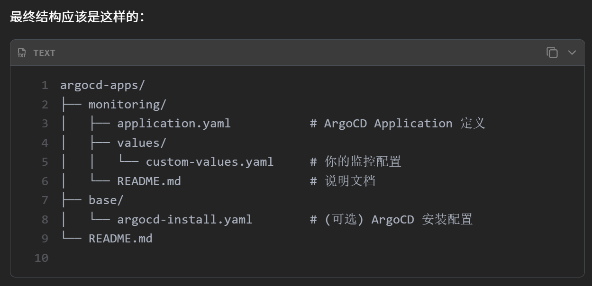
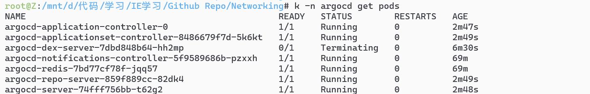

# 结构说明


# 先装Argocd
```sh
# 手动删除 dex 的 deployment
kubectl delete deployment -n argocd argocd-dex-server

# 然后升级配置禁用 dex
helm upgrade argocd argo/argo-cd \
  --namespace argocd \
  --values values.yaml \
  --version 7.7.15 \
  --set dex.enabled=false
```


#  部署 monitoring

# 连接GIT分支
```sh
仓库地址
https://github.com/lushiheng123/Code-for-Argo
